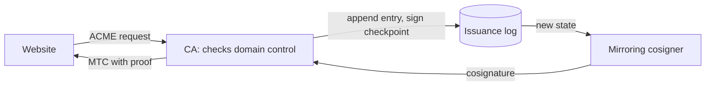
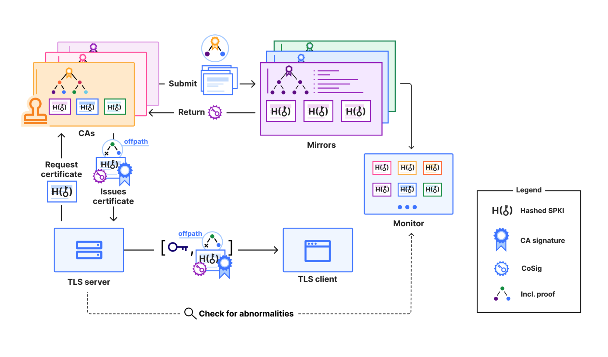
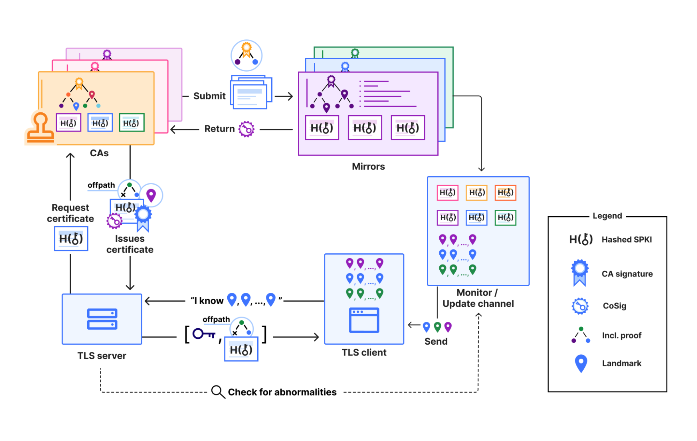
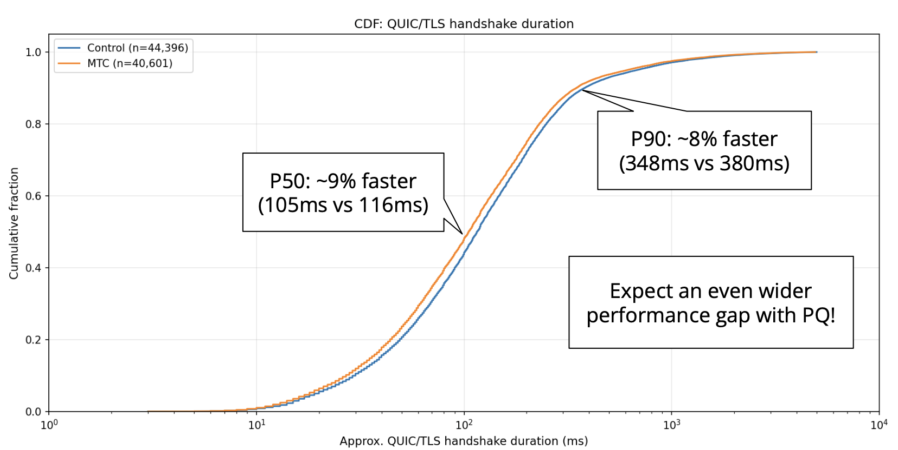

# Merkle Tree Certificates in plain words

**Goal:** understand the mechanics of how a post-quantum certificate authority can issue small, publicly logged certificates. You already know what HTTPS and a certificate authority (CA) are, so we start from the problem.

## Why this exists: signatures are about to get big

Your browser trusts a site because a CA vouched for it with a digital signature. Quantum computers are the reason this has to change: Cloudflare has committed to moving to post-quantum (PQ) cryptography [by 2029](https://blog.cloudflare.com/pq-ca-with-mtcs/). ([S1](https://blog.cloudflare.com/pq-ca-with-mtcs/))

The catch is size. ML-DSA-44, one of the most performant PQ algorithms standardized by NIST, has 2,420-byte signatures against 64 bytes for ECDSA-P256, and 1,312-byte public keys against 64 bytes. ([S4](https://blog.cloudflare.com/bootstrap-mtc/)) A typical TLS handshake today already carries "5 signatures and 2 public keys". ([S4](https://blog.cloudflare.com/bootstrap-mtc/)) Swapping PQ in naively "would lead to unacceptable performance degradation". ([S1](https://blog.cloudflare.com/pq-ca-with-mtcs/))

| | Classical (ECDSA-P256) | ML-DSA-44 |
| --- | --- | --- |
| Signature | 64 bytes | 2,420 bytes |
| Public key | 64 bytes | 1,312 bytes |

([S4](https://blog.cloudflare.com/bootstrap-mtc/))

## Two things you need first

```callout kind=definition
Certificate transparency (CT): "publicly auditable, append-only, untrusted logs of all issued certificates." ([S2, §1](https://www.rfc-editor.org/rfc/rfc6962.txt))
```

Today, when a CA issues a certificate it must also submit it to at least two public logs. ([S1](https://blog.cloudflare.com/pq-ca-with-mtcs/)) The problem is that transparency was bolted on: certificates get logged several times, in different forms, across logs, so monitors have to download everything. Cloudflare estimates PQ signatures will balloon the data CT logs store by 40x. ([S1](https://blog.cloudflare.com/pq-ca-with-mtcs/))

```callout kind=definition
ACME: a protocol "that a CA and an applicant can use to automate the process of verification and certificate issuance." ([S5, Abstract](https://www.rfc-editor.org/rfc/rfc8555.txt))
```

## The core trick: a Merkle tree and an inclusion proof

Instead of signing every certificate, a CA arranges certificates into a Merkle tree. Each leaf is a certificate and each inner node is the hash of its children. Signing the head of the tree covers every certificate in it, because changing any one would change the treehead and break the signature. ([S4](https://blog.cloudflare.com/bootstrap-mtc/))

```callout kind=definition
"An inclusion proof for a certificate consists of the hash of each sibling node along the path from the certificate to the treehead." ([S4](https://blog.cloudflare.com/bootstrap-mtc/))
```

With a validated treehead, that short list of hashes proves the certificate is in the tree, so one signature covers a whole batch. ([S4](https://blog.cloudflare.com/bootstrap-mtc/)) The article puts it as a design slogan: "don't log what you issue, issue by logging." Transparency becomes a requirement for operation rather than an add-on. ([S1](https://blog.cloudflare.com/pq-ca-with-mtcs/))

## How an MTC gets issued

1. The website asks the CA for a certificate via ACME. The CA checks the site controls the domain. ([S1](https://blog.cloudflare.com/pq-ca-with-mtcs/))
2. The CA adds the certificate data to an append-only log and signs a checkpoint over the log's state. ([S1](https://blog.cloudflare.com/pq-ca-with-mtcs/))
3. It sends the new state to a **mirroring cosigner**, which stores a copy of the log and checks each new state is append-only and consistent. This stops the CA showing different views of issuance to different parties. ([S1](https://blog.cloudflare.com/pq-ca-with-mtcs/))
4. The CA builds the certificate from the cosignatures, the server's public key and an inclusion proof, and sends it to the server. ([S1](https://blog.cloudflare.com/pq-ca-with-mtcs/))


([S1, Issuing MTCs](https://blog.cloudflare.com/pq-ca-with-mtcs/))



*Source: [S1](https://blog.cloudflare.com/pq-ca-with-mtcs/), Cloudflare*

Chrome's draft policy requires at least two cosignatures: one from a Chrome-recognized mirroring cosigner run by a different organization, and one from the CA itself. ([S1](https://blog.cloudflare.com/pq-ca-with-mtcs/)) The mirror protocol is described as how "to mirror a transparency log, and how to obtain signatures asserting that a mirror has done so." ([S6](https://c2sp.org/tlog-mirror))

## Making certificates small: landmarks

A *standalone* MTC carries a cosigned tree head and an inclusion proof, so it still ships heavy PQ signatures. ([S1](https://blog.cloudflare.com/pq-ca-with-mtcs/)) The *landmark-relative* form avoids that: CAs designate a sequence of subtrees covering all active certificates as a landmark and distribute them to clients out of band. In the handshake, the browser just checks the server's certificate appears in a trusted subtree. ([S1](https://blog.cloudflare.com/pq-ca-with-mtcs/))

Cloudflare says the handshake then needs one public key, one signature and one inclusion proof of under 1 kB. ([S1](https://blog.cloudflare.com/pq-ca-with-mtcs/)) Clients that are offline, new or missing the landmark need a standalone fallback. ([S1](https://blog.cloudflare.com/pq-ca-with-mtcs/))



*Source: [S1](https://blog.cloudflare.com/pq-ca-with-mtcs/), Cloudflare*

## Did it work?

Cloudflare served billions of MTCs to 50% of Chrome Beta 146 for selected domains, using a fake "bootstrap CA". At the median, landmark MTCs were 9% faster than a classical chain, mostly from intermediate elision, and the test used classical signatures, so a bigger gain is expected with PQ. ([S1](https://blog.cloudflare.com/pq-ca-with-mtcs/))



*Source: [S1](https://blog.cloudflare.com/pq-ca-with-mtcs/), Cloudflare*

## What is still unknown

The article lists open questions: whether independent monitors can verify MTC logs at production volume, whether multiple CAs and cosigners will appear, and how browsers should balance landmark performance against fallbacks. Cloudflare's CA still needs to apply to Chrome's Quantum-resistant root store. It targets early 2027. ([S1](https://blog.cloudflare.com/pq-ca-with-mtcs/))

## Not covered by the pack

- What an X.509 certificate contains (the article says MTCs can be encoded in that format).
- Detailed cosigner protocol and the Chrome root program policy.
- Why the article says PQ signatures are about 40x larger while Cloudflare's earlier post says about 20-fold; the pack doesn't reconcile them.

Run enrich again if you want these filled in.
